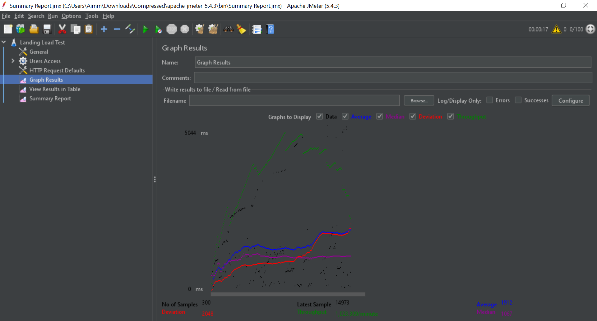

# Laporan Praktikum 4 Sistem Administrasi Server #

Abdillah Ainur Ridla (1202190060)

Abdul Muhaimin Nurdin (1202199001)

### Container APP (PHP 5) ###
Pertama, kita lakukan terlebih dahulu salin container debian_php5.6 untuk menjaga backup container. setelah itu jalankan container salinan tersebut.

        lxc-copy -n debian_php5.6 -N debian_php5.6_2 -sKD		 
        lxc-copy -n debian_php5.6 -N debian_php5.6_3 -sKD
        sudo lxc-start -n debian_php5.6_2	          
        sudo lxc-start -n debian_php5.6_3
        Sudo lxc-ls -f	

Pada Container debian_php5.6_2 lakukan configurasi IP

Pada Container debian_php5.6_3 lakukan configurasi IP

Setelah itu, lakukan konfigurasi pada hosts. disini kita tambahkan domain serta nama domain container kita.

        nano /etc/hosts

Lalu masuk directory sites-avalaible, di folder tersebut kita lakukan edit domain file tersebut dengan mengganti name servernya. jangan lupa restart containernya

         nano /etc/nginx/sites-available/lxc_php5.dev

### Container BLOG (PHP 7)###
Sekarang ganti kita lakukan salin container ubuntu_php7.4. setelah itu jalankan container salinan tersebut.

        lxc-copy -n ubuntu_php7.4 -N ubuntu_php7.4_2 -sKD		 
        lxc-copy -n ubuntu_php7.4 -N ubuntu_php7.4_3 -sKD
        sudo lxc-start -n ubuntu_php7.4_2			
        sudo lxc-start -n ubuntu_php7.4_3
        Sudo lxc-ls -f										   

Pada Container ubuntu_php7.4_2 lakukan configurasi IP

Pada Container ubuntu_php7.4_3 lakukan configurasi IP

Setelah itu, lakukan konfigurasi pada hosts. disini kita tambahkan domain serta nama domain container kita.

        nano /etc/hosts

Lalu masuk directory sites-avalaible, di folder tersebut kita lakukan edit domain file tersebut dengan mengganti name servernya. jangan lupa restart containernya

         nano /etc/nginx/sites-available/lxc_php7.dev
         exit			

### Vm Utama ###
Pada VM Utama, Daftarkan semua container yang telah kita buat di hosts (Pada VM Utama), jangan lupa lakukan restart vm

        Sudo Nano /etc/hosts

Lalu kita buka dan jalankan Software Jmeter, Ubah jumlah pengguna dari akses pengguna pada masing-masing user (50, 100, 150)

- 50

Tambahkan banyak User sejumlah 50 User untuk melakukan akses Website

Grafik didapatkan pada saat diakses 50 Users

Detail User yang mengakses Website

Detail website yang di akses 50 Users secara bersamaan dimasing-masing halaman landing, blog serta app

- 100 User

Tambahkan banyak User sejumlah 100 User untuk melakukan akses Website

Grafik didapatkan pada saat diakses 100 Users

Detail User yang mengakses Website

Detail website yang di akses 100 Users secara bersamaan dimasing-masing halaman landing, blog serta app

- 150 User

Tambahkan banyak User sejumlah 150 User untuk melakukan akses Website

Grafik didapatkan pada saat diakses 150 Users

Detail User yang mengakses Website

Detail website yang di akses 150 Users secara bersamaan dimasing-masing halaman landing, blog serta app

Lalu balik ke dalam VM kita, masuk kedalam directory file vm.local yang terletak di sites-available. tambhakan upstream pada masing-masing container (landing, php5, dan php7), lalu didalam container tersebut kita lakukan pemanggilan file domain.

         nano /etc/nginx/sites-available/vm.local

rubah juga pada bagian url proxy_pass

Setelah melakukan perubahan pada vm kita, jangan lupa merestart vm dan buka lagi software Jmeternya. lalu kita analisa seteleh kita lakukan konfigurasi ulang dengan menambahkan load balacing upstream, apakah terdapat perubahan??

- 50 User menggunakan Load Balacing Upstream

Tambahkan banyak User sejumlah 50 User untuk melakukan akses Website

Grafik didapatkan pada saat diakses 50 Users

Detail User yang mengakses Website

Detail website yang di akses 50 Users secara bersamaan dimasing-masing halaman landing, blog serta app

- 100 User menggunakan Load Balacing Upstream

Tambahkan banyak User sejumlah 100 User untuk melakukan akses Website

Grafik didapatkan pada saat diakses 100 Users

Detail User yang mengakses Website

Detail website yang di akses 100 Users secara bersamaan dimasing-masing halaman landing, blog serta app

- 150 User menggunakan Load Balacing Upstream

Tambahkan banyak User sejumlah 150 User untuk melakukan akses Website

Grafik didapatkan pada saat diakses 150 Users

Detail User yang mengakses Website

Detail website yang di akses 150 Users secara bersamaan dimasing-masing halaman landing, blog serta app

Analisa hasil Software Jmeter

Rata-Rata Waktu Pengguna Akses Web

50 Pengguna

Ketika terdapat 50 Pengguna, Rata-Rata Waktu yang butuhkan pengguna dalam mengakses masing-masing halaman.

Menggunakan Load Balance

- Landing (50 Pengguna) : 1314 mdtk / 0,006 detik

- Blog (50 Pengguna) : 652 mdtk / 0,652 detik

- App (50 Pengguna) : 550 mdtk / 0,55 detik Rata-Rata Keseluruhan Halaman(150 Pengguna) : 859 mdtk / 0,859 detik

Tanpa Load Balance

- Landing (50 Pengguna) : 6410 mdtk / 6,41 detik

- Blog (50 Pengguna) : 773 mdtk / 0,773 detik

- App (50 Pengguna) : 191 mdtk / 0,191 detik Rata-Rata Keseluruhan Halaman(150 Pengguna) : 2458 mdtk / 2,458 detik

100 Pengguna

Ketika terdapat 100 Pengguna, Rata-Rata Waktu yang butuhkan pengguna dalam mengakses masing-masing halaman.

Menggunakan Load Balance

- Landing (100 Pengguna): 2541 mdtk / 2,541 detik

- Blog (100 Pengguna) : 23930 mdtk / 23,93 detik

- App (100 Pengguna) : 6334 mdtk / 6,334 detik Rata-Rata Keseluruhan Halaman(300 Pengguna) : 10935 mdtk / 10,935 detik

Tanpa Load Balance

- Landing (100 Pengguna): 3348 mdtk / 3,348 detik

- Blog (100 Pengguna) : 1305 mdtk / 1,305 detik

- App (100 Pengguna) : 1082 mdtk / 1,082 detik Rata-Rata Keseluruhan Halaman(300 Pengguna) : 1912 mdtk / 1,912 detik

150 Pengguna

Ketika terdapat 150 Pengguna, Rata-Rata Waktu yang butuhkan pengguna dalam mengakses masing-masing halaman.

Menggunakan Load Balance

- Landing (150 Pengguna): 16465 mdtk / 16,465 detik

- Blog (150 Pengguna) : 1667 mdtk / 1,667 detik

- App (150 Pengguna) : 994 mdtk / 0,994 detik Rata-Rata Keseluruhan Halaman(450 Pengguna) : 6375 mdtk / 6,375 detik

Tanpa Load Balance

- Landing (150 Pengguna): 4834 mdtk / 4,834 detik

- Blog (150 Pengguna) : 3424 mdtk / 3,424 detik

- App (150 Pengguna) : 2052 mdtk / 2,052 detik Rata-Rata Keseluruhan Halaman(450 Pengguna) : 3437 mdtk / 3,437 detik

Dari Jumalh Pengguna(50,100,150), Disini kita dapat mengetahui bahwa rata-rata waktu pengguna mengakses web kita lebih cepat (Menggunakan Load balancer) dibandingkan jika kita tidak menggunakan load balancer.

Throughput (kecepatan/rate transfer data efektif, yang diukur dalam bps).

50 Pengguna

Ketika terdapat 50 Pengguna, melakukan transfer data dalam masing-masing halaman.

Menggunakan Load Balance

- Landing (50 Pengguna) : 22/detik

- Blog (50 Pengguna) : 18/detik

- App (50 Pengguna) : 19/detik 
Total Throughput Keseluruhan Halaman(150 Pengguna) : 41/detik

Tanpa Load Balance

- Landing (50 Pengguna) : 6/detik

- Blog (50 Pengguna) : 10/detik

- App (50 Pengguna) : 11/detik Total Throughput Keseluruhan Halaman(150 Pengguna) : 15/detik

100 Pengguna

Ketika terdapat 100 Pengguna, melakukan transfer data dalam masing-masing halaman.

Menggunakan Load Balance

- Landing (100 Pengguna) : 17/detik

- Blog (100 Pengguna) : 23/menit

- App (100 Pengguna) : 23/menit

Total Throughput Keseluruhan Halaman(300 Pengguna) : 1,2/detik

Tanpa Load Balance

- Landing (100 Pengguna) : 15,6/detik

- Blog (100 Pengguna) : 7/detik

- App (100 Pengguna) : 5,9/detik

Total Throughput Keseluruhan Halaman(300 Pengguna) : 17,1/detik

150 Pengguna

Ketika terdapat 150 Pengguna, melakukan transfer data dalam masing-masing halaman.

Menggunakan Load Balance

- Landing (150 Pengguna) : 46,7/menit

- Blog (150 Pengguna) : 46,7/menit

- App (150 Pengguna) : 46,8/menit

Total Throughput Keseluruhan Halaman(450 Pengguna) : 2,3/detik

Tanpa Load Balance

- Landing (150 Pengguna) : 20,3/detik

- Blog (150 Pengguna) : 8,2/detik

- App (150 Pengguna) : 8,3/detik 

Total Throughput Keseluruhan Halaman(450 Pengguna) : 22,3/detik

Dari Jumlah Pengguna(50,100,150), Disini kita dapat mengetahui bahwa kecepatan tranfers data pada web kita lebih besar(Menggunakan Load balancer) dibandingkan jika kita tidak menggunakan load balancer.
								
